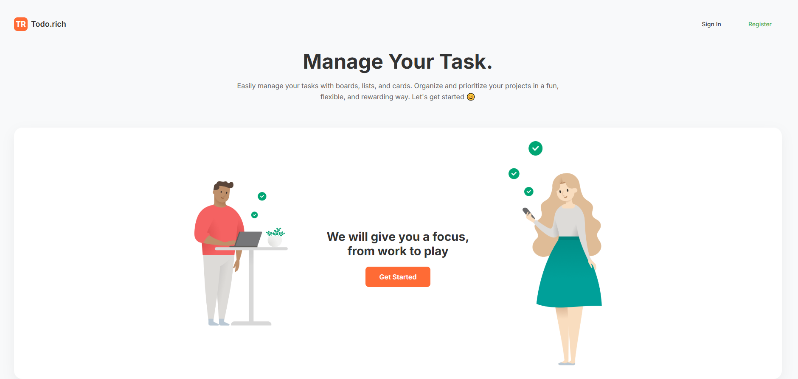
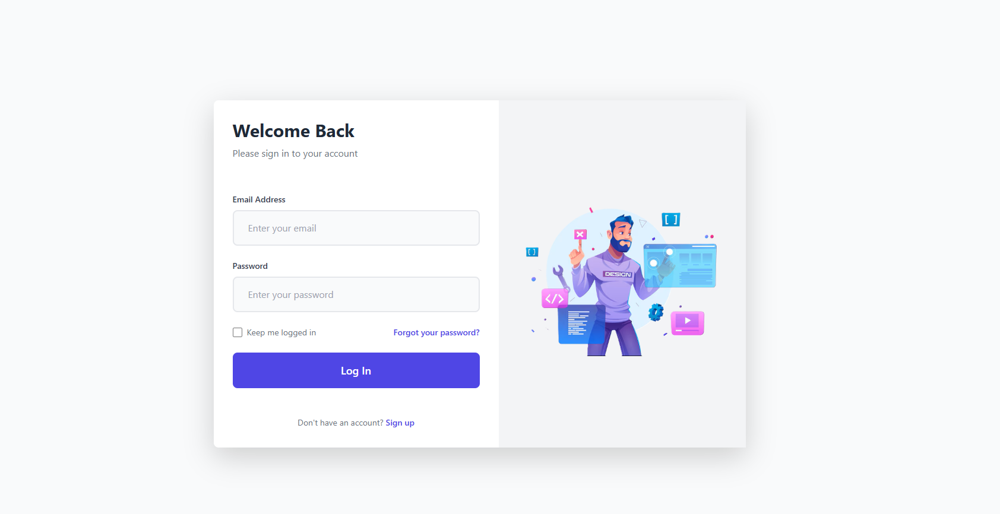
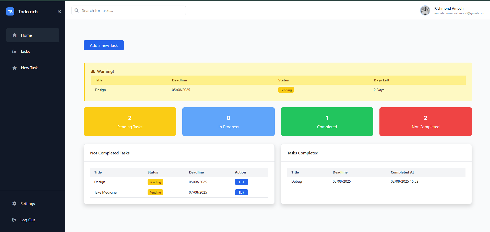
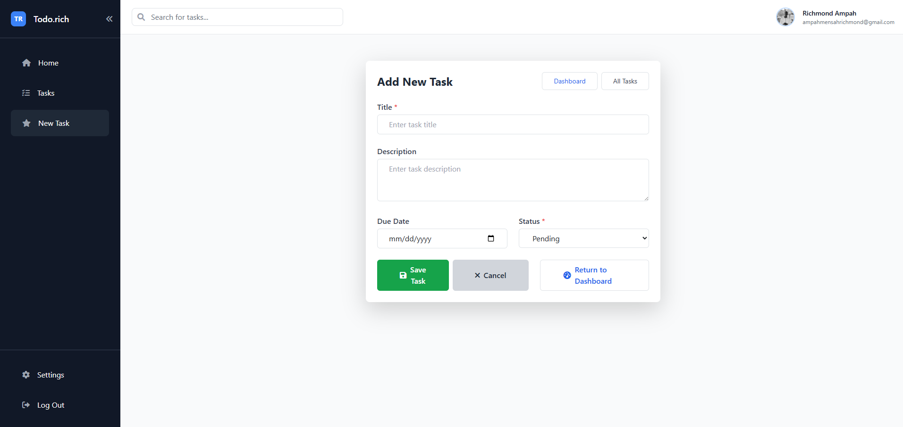

# TodoList-A Project Report

## 1. Using Laravel / PHP Framework
This project is built using the Laravel PHP framework, leveraging its MVC architecture, routing, Eloquent ORM, and built-in security features. Laravel's structure ensures maintainable and scalable code.

## 2. CRUD Functionality
The application supports full CRUD (Create, Read, Update, Delete) operations for tasks. Users can add new tasks, view task lists, update task details, and delete tasks. All operations are handled efficiently with real-time feedback.

## 3. User Authentication (Login/Register)
User authentication is implemented using Laravel's authentication scaffolding. Users can register, log in, and log out securely. Passwords are hashed, and session management ensures data privacy.

## 4. Responsive Design with CSS Framework
The frontend uses a modern CSS framework (such as Bootstrap or Tailwind CSS) to ensure the application is fully responsive. The layout adapts seamlessly to desktops, tablets, and mobile devices, providing a consistent user experience.

## 5. Form Validation
All forms in the application include robust validation, both on the client and server sides. Users receive clear feedback on input errors, ensuring data integrity and a smooth user experience.

## 6. Upload Files / Media
The application allows users to upload files or media (such as profile pictures or task attachments). Uploaded files are stored securely and can be managed through the user interface.

## 7. Additional Features
- **Search:** Users can search for tasks by keywords, making it easy to find specific items.
- **Export:** Task data can be exported for backup or reporting purposes (e.g., CSV or PDF export).

## 8. Code Neatness & Project Structure
The codebase follows Laravel's best practices for organization and readability. Controllers, models, views, and routes are separated logically. The project structure is clean, making it easy to maintain and extend.

## 9. Screenshots
Below are spaces to insert screenshots of the application and its features:

### Landing Page

### Login Page

### Dashboard

### Add New Task

<!-- Add more screenshots as needed -->

---
This project demonstrates a comprehensive understanding of modern web development using Laravel, with a focus on usability, security, and maintainability.
